# 智能体资讯处理系统

基于 Mastra 框架构建的智能化新闻资讯获取和处理系统，能够自动从多个数据源获取最新资讯，使用AI进行内容分析、重写和格式转换。

## 🚀 功能特性

- **多源资讯获取**: 支持RSS feeds、新闻API、网页抓取等多种数据源
- **智能内容分析**: 使用DeepSeek AI分析文章质量和相关性
- **内容重写优化**: AI重写文章，使其更适合目标受众
- **格式转换**: 自动优化标题、段落结构，添加emoji等
- **去重处理**: 智能识别和过滤重复内容
- **质量评分**: 对文章进行质量评估和筛选

## 📦 安装

```bash
# 克隆项目
git clone <your-repo-url>
cd my-mastra-app

# 安装依赖
npm install

# 复制环境变量配置
cp .env.example .env
```

## ⚙️ 配置

编辑 `.env` 文件，设置必要的API密钥：

```env
# DeepSeek API密钥 (推荐 - 网络稳定)
DEEPSEEK_API_KEY=your_deepseek_api_key_here

# OpenAI API密钥 (备选)
OPENAI_API_KEY=your_openai_api_key_here

# 新闻API密钥 (可选)
NEWS_API_KEY=your_news_api_key_here

# 网络代理配置 (如需要)
USE_PROXY=false
PROXY_HOST=127.0.0.1
PROXY_PORT=7890
PROXY_PROTOCOL=http
```

### AI 服务配置

系统默认使用 **DeepSeek** 作为 AI 服务提供商，具有以下优势：

- ✅ **网络稳定**: 国内服务器，连接更稳定
- ✅ **中文优化**: 对中文内容处理效果更好
- ✅ **成本效益**: 价格更有竞争力
- ✅ **API兼容**: 完全兼容 OpenAI API

#### 获取 DeepSeek API Key

1. 访问 [DeepSeek 官网](https://platform.deepseek.com/)
2. 注册账号并登录
3. 在控制台创建 API Key
4. 将 API Key 添加到 `.env` 文件中

## 🎯 快速开始

### 基础使用

```typescript
import { mastra } from './src/mastra';
import { getNewsSourcesConfig, getProcessingConfig } from './src/config';

async function processNews() {
  const sources = getNewsSourcesConfig();
  const config = getProcessingConfig();
  
  const result = await mastra.runWorkflow('newsProcessingWorkflow', {
    sources,
    limit: config.limit,
    hoursBack: config.hoursBack,
    minQualityScore: config.minQualityScore,
    maxArticles: config.maxArticles,
    targetStyle: config.targetStyle,
    targetAudience: config.targetAudience
  });
  
  console.log(`处理了 ${result.summary.totalProcessed} 篇文章`);
  return result.processedArticles;
}
```

### 运行示例

```bash
# 基础使用示例
npx tsx examples/basic-usage.ts

# 自定义新闻源示例
npx tsx examples/custom-sources.ts

# 工具测试
npx tsx examples/test-tools.ts

# 测试 DeepSeek AI 配置
npm run test:deepseek
```

## 🛠️ 开发

```bash
# 开发模式
npm run dev

# 构建
npm run build

# 启动
npm start
```

## 📊 系统架构

```mermaid
graph LR
    A[RSS/API/Web] --> B[内容获取]
    B --> C[去重过滤]
    C --> D[AI分析]
    D --> E[内容重写]
    E --> F[格式转换]
    F --> G[输出结果]
```



### 核心模块

1. **资讯获取模块**: RSS解析、API集成、网页抓取
2. **内容处理模块**: AI分析、总结、重写
3. **格式转换模块**: 标题优化、段落重构、emoji添加

## 🔧 自定义配置

### 新闻源配置

```typescript
const customSources = [
  {
    type: 'rss',
    name: '自定义RSS源',
    url: 'https://example.com/rss.xml',
    category: '科技新闻'
  },
  {
    type: 'api',
    name: 'NewsAPI',
    url: 'https://newsapi.org/v2/top-headlines',
    category: '热点新闻',
    apiKey: 'your-api-key'
  }
];
```

### 处理参数

- `limit`: 每个源获取的文章数量 (默认: 10)
- `hoursBack`: 获取多少小时内的文章 (默认: 24)
- `minQualityScore`: 最低质量分数 1-10 (默认: 6)
- `maxArticles`: 最多处理文章数量 (默认: 5)
- `targetStyle`: 目标写作风格 (默认: 'engaging')
- `targetAudience`: 目标受众 (默认: 'general')

## 📝 输出格式

处理后的文章包含以下字段：

```typescript
{
  title: string;           // 优化后的标题
  subtitle?: string;       // 副标题
  content: string;         // 格式化的内容
  summary: string;         // 文章摘要
  tags: string[];          // 关键词标签
  category: string;        // 文章分类
  estimatedReadTime: number; // 预计阅读时间(分钟)
  wordCount: number;       // 字数统计
  author?: string;         // 作者
  source?: string;         // 来源
  publishDate: string;     // 发布日期
}
```

## 🔧 故障排除

### 常见问题

#### 1. AI 服务连接失败

**问题**: `Cannot connect to API: Connect Timeout Error`

**解决方案**:

- 确保 DeepSeek API Key 已正确配置
- 检查网络连接是否正常
- 运行测试命令验证配置：`npm run test:deepseek`

#### 2. API Key 无效

**问题**: `Invalid API key`

**解决方案**:

- 检查 `.env` 文件中的 API Key 是否正确
- 确保 API Key 有足够的额度
- 验证 API Key 格式是否正确

#### 3. 切换回 OpenAI

如果需要切换回 OpenAI：

1. 修改 `src/mastra/agents/content-processor-agent.ts`
2. 将导入改为：`import { openai } from '@ai-sdk/openai';`
3. 将模型配置改为：`model: openai('gpt-4o')`
4. 确保设置了有效的 `OPENAI_API_KEY`

### 获取帮助

- 查看 [DeepSeek 文档](https://platform.deepseek.com/docs)
- 提交 [GitHub Issue](https://github.com/your-repo/issues)

## 🤝 贡献

欢迎提交 Issue 和 Pull Request！

## 📄 许可证

MIT License
